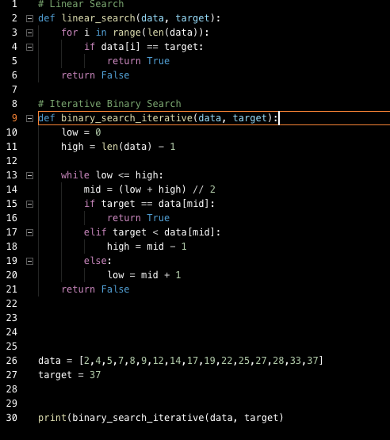

# Search Algorithms

## Definition and Types of Search Algorithms

Searching Algorithms are designed to check for an element or retrieve an element from any data structure where it is stored. Based on the type of search operation, these algorithms are generally classified into two categories:

**Linear Search (Sequential Search):** In this, the list or array is traversed sequentially and every element is checked.

**Binary Search (Interval Search):** These algorithms are specifically designed for searching in sorted data-structures. These type of searching algorithms are much more efficient than Linear Search as they repeatedly target the center of the search structure and divide the search space in half.

## Team 5:
Team Members:  Isaac, Tristan, Heggy, Paris

## Overview
In this lesson, you'll learn how the search algorithm works to find information efficiently and elegantly.

## Learning Objectives
By the end of this lesson, you will be able to:
- Understand the Big O complexities of brute force and binary search approaches.
- Describe how binary search works.
- Write a binary search algorithm to find a value in an array.

## Prerequisites
* Big O Notation
* Recursion
* Intro to Sorting Algorithms

Linear search algorithm
  - 
Binary search algorithm 
  - works to find information efficiently and elegantly

## Code Snippet Binary Search(Tristan)
  

## Find use cases on Search algorithm in the world (Paris)

## Find a good videos to watch for visual learners (Heggy-done)
  - Harvard cs50 Linear Search Tree [part 1/2](https://youtu.be/TwsgCHYmbbA)
  - Harvard cs50 Binary Search Tree [part 2/2](https://youtu.be/T98PIp4omUA)
  - HackerRank [Binary Search](https://www.youtube.com/watch?v=P3YID7liBug)
  - Udacity Binary Search Tree [part 1/2](https://youtu.be/0VN5iwEyq4c)
  - Udacity Binary Search Tree [part 2/2](https://youtu.be/7WbRB7dSyvc)
  - LINUXANDCHILL [Binary Search Tree](https://youtu.be/92e5Ih4Chbk)

## Additional Resources
- Check out [this article](https://medium.com/@codingfreak/binary-search-practice-problems-4c856cd9f26c) that outlines common interview questions related to binary search.
- [More thoughts](http://blog.gainlo.co/index.php/2017/01/12/rotated-array-binary-search/) on how binary search appears in job interviews.
- Algorithmic folk dancers, this time with [search](https://www.youtube.com/watch?v=iP897Z5Nerk)!
- Khan [binary](https://www.khanacademy.org/computing/computer-science/algorithms#binary-search) search 

## Credit:
- GA [lesson](https://git.generalassemb.ly/software-engineering-immersive/SEI-Course-Materials/tree/master/6_computer-science-materials/algorithms/search-algorithms) plan 
- Geek for Geeks [image](https://www.geeksforgeeks.org/searching-algorithms/)

